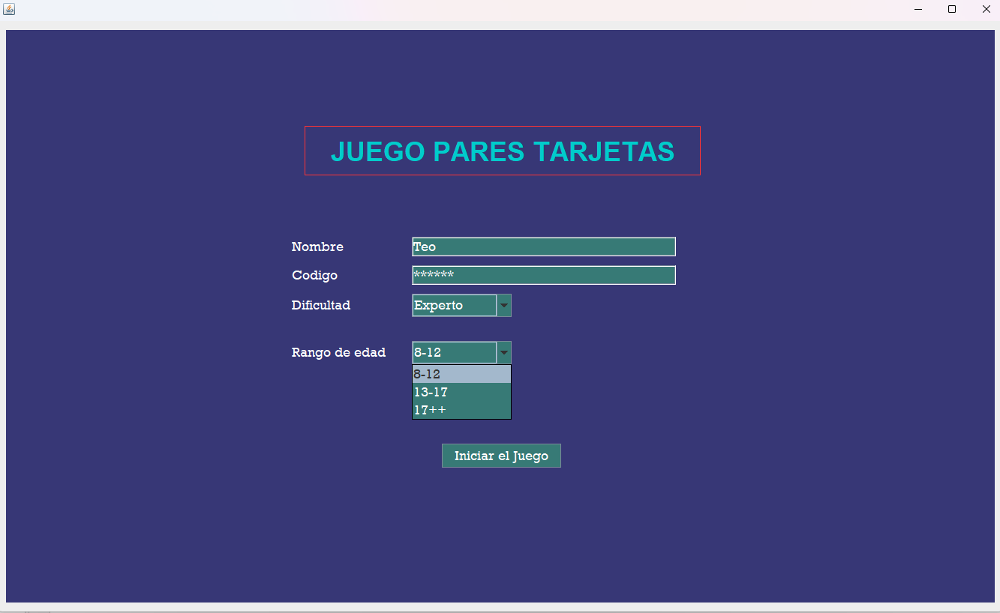
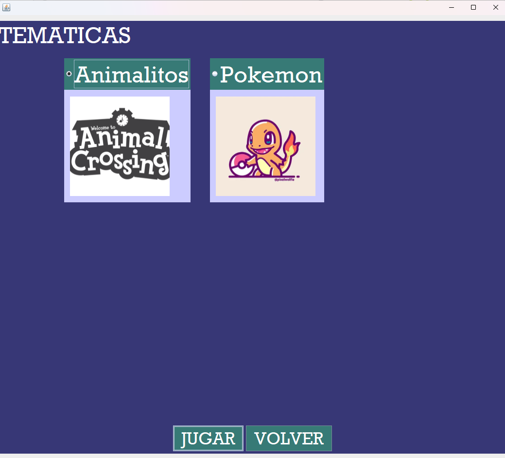
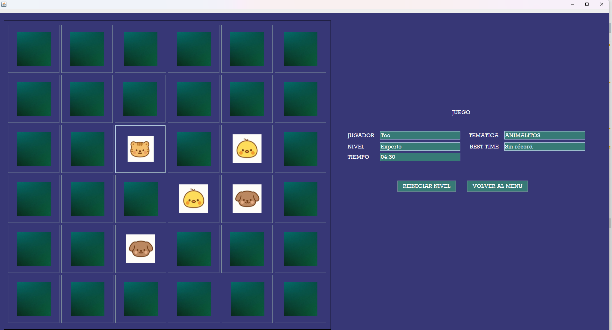
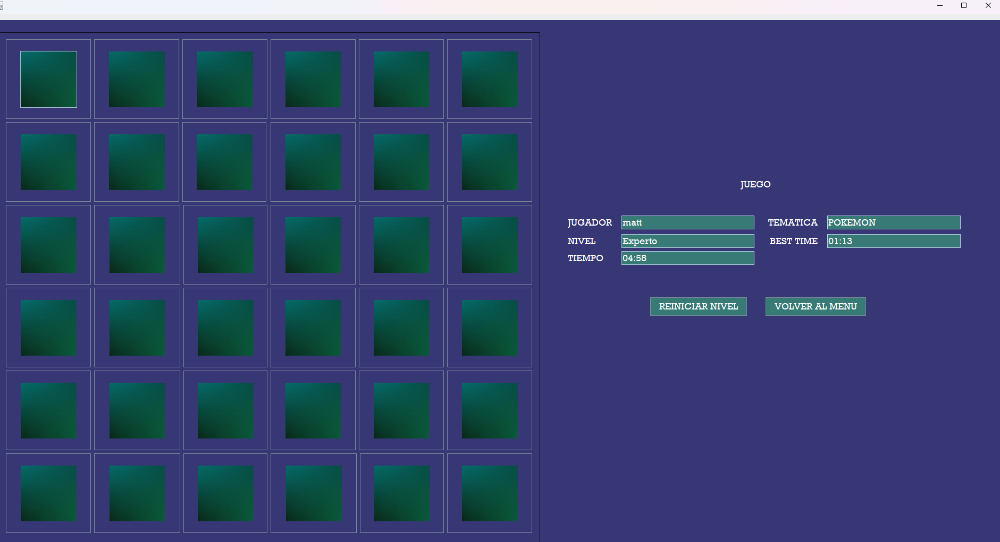

# Java Memory Game

## 📌 Overview

Java Memory Game is a desktop application developed using Java with MVC architecture and MySQL integration.  
The system allows players to compete in a dynamic memory-matching game with persistent data storage and ranking management.

This project was designed following clean architecture principles and separation of concerns.

---

## 🏗 Architecture

The application follows the MVC (Model-View-Controller) pattern:

- **Model** → Game logic, entities, database connection and DAO classes.
- **View** → Swing graphical interface.
- **Controller** → Handles interaction between UI and game logic.

The project also implements the DAO pattern for database operations.

---

## ⚙ Technologies Used

- Java
- Java Swing
- MySQL
- JDBC
- MVC Architecture
- DAO Pattern
- Git & GitHub

---

## 🧠 Features

- Player registration stored in database
- Persistent score saving
- Ranking system
- Dynamic difficulty levels
- Theme selection
- Game timer
- Match detection logic
- Structured MVC design
- Database connection handling

---

## 🚀 Future Improvements

- User authentication system
- Online multiplayer mode
- Improved UI/UX design
- REST API version
- Migration to web version (Spring Boot + React)

---

## 📸 Screenshots

### Main Menu

### Level Selection

### Gameplay

### Score Screen

